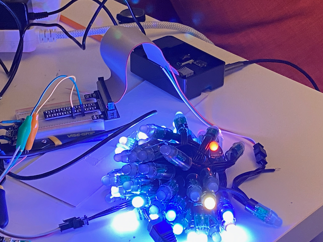

### My Christmas Tree Lights project

This all started with the video by Matt Parker from [@standupmaths](https://github.com/standupmaths/), and his video ["I wired my tree with 500 LED lights and calculated their 3D coordinates"](https://www.youtube.com/watch?v=TvlpIojusBE).

This is my hack at it.   

### The gear:

Ok so I'm using the same lights that Matt linked to in his video.  (affiliate links because Amazon has a handy tool bar to make short URLs) [https://amzn.to/3AcK3yj](https://amzn.to/3AcK3yj)- **ALITOVE WS2811 RGB LED Pixels Light Individually Addressable 12mm Diffused Digital Full Color LED**

I already had a Rasbery Pi 3:

	rwhiffen@raspberrypi:~/prog/XmasTreeLights $ more /sys/firmware/devicetree/base/model
	Raspberry Pi 3 Model B Rev 1.2
	rwhiffen@raspberrypi:~/prog/XmasTreeLights $

I boought this 10A 5v power supply that came up as a *Products related to this item* suggestion. [https://amzn.to/3g0u67x](https://amzn.to/3g0u67x) - **Aclorol 5V 10A 50W Power Supply 100V-240V AC to DC Adapter 5V 10 amp Switching Converter 5.5x2.1mm Plug for WS2811 WS2812B WS2813 5V LED Strip Pixel Lights**

The other stuff I had lying around from other projects, like gator clips with breadboard pins etc.

### The software and wiring

Here's a bunch of links that taught me how to do this.  Sites that I mimiced the results of may be a better description.

* [The Adafruit Raspberry Pi NeoPixel tutorial](https://learn.adafruit.com/neopixels-on-raspberry-pi/raspberry-pi-wiring) - using the *Using External Power Source Without Level Shifting* config
* Adafruit again - [how to set up Python for NeoPixels on a Pi](https://learn.adafruit.com/neopixels-on-raspberry-pi/python-usage)
* MIT's[ GSD6338 github XmasTree](https://github.com/GSD6338/XmasTree) project
* There were a bunch of other pages I referenced while trying to debug what was going wrong with my setup.  If I find them in my history I'll put them here also.

### Making the lights work for the first time

This did not start out well.  Initially I couldn't get the pixes to light up correctly.

First - most the LEDs wouldn't light up.  Second the colors were off and they'd flicker and blink oddly.  I had also incorrectly wired the pins at some point - now I'm not sure if I fried something.   I'll write up more in a blog post but basically I had to switch to GPIO 21 -** pixel_pin = board.D21**
